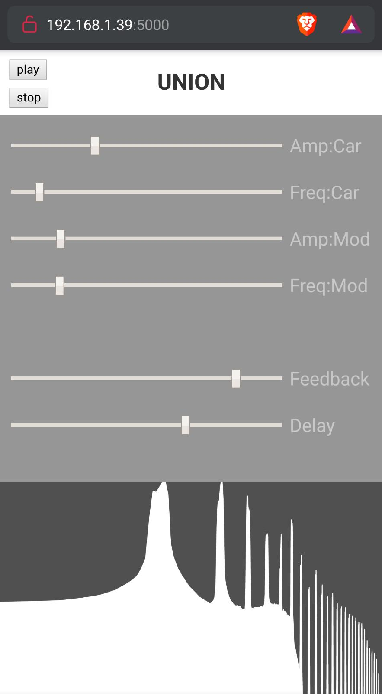

# UNION

This synthesizer is produced with [p5js](https://p5js.org/).
It is an **FM synthesizer** passing through a **reverberation** and **feedback**.

The interface is made of two parts, an upper synthesizer control part and a lower spectrum display part

## Install and setup

In order to get it run you just have to enter this command in your terminal.
`npm install`
`npm run dev`

Then connect your smart-phone to the given IP. (by `npm run dev`)

## Getting started

- Clone the repository :

  `git clone https://github.com/fouVReaux/UNION.git `

- run the `npm install` command
- run the `npm run dev`

## License

[MIT](LICENSE)
